# Elsie CRT Royale Presets

These are ini config presets for the [CRT Royale](https://github.com/akgunter/crt-royale-reshade) [Reshade](https://reshade.me) shader.

Here you will 4 sets of presets from 4k to 720p resolutions. Each containing 3 presets per phospher mask triad type.

## Gallery

### 4k

Grill Mask:  

Shadow Mask:  

Slot Mask:  

### 2k

Grill Mask:  
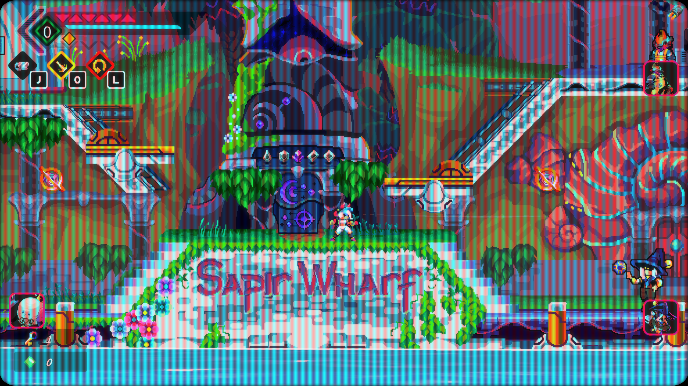

Shadow Mask:  

Slot Mask:  

### 1920x1080

Grill Mask:  
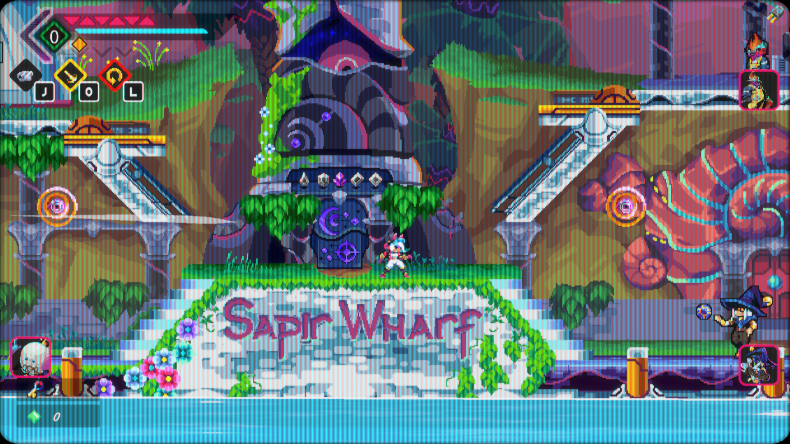

Shadow Mask:  
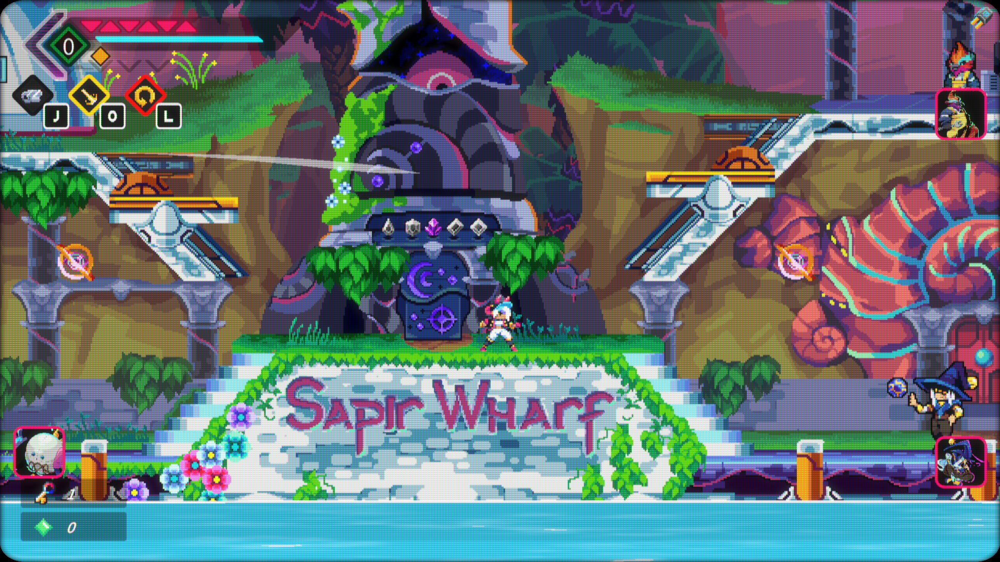

Slot Mask:  

### 1280x720

Grill Mask:  
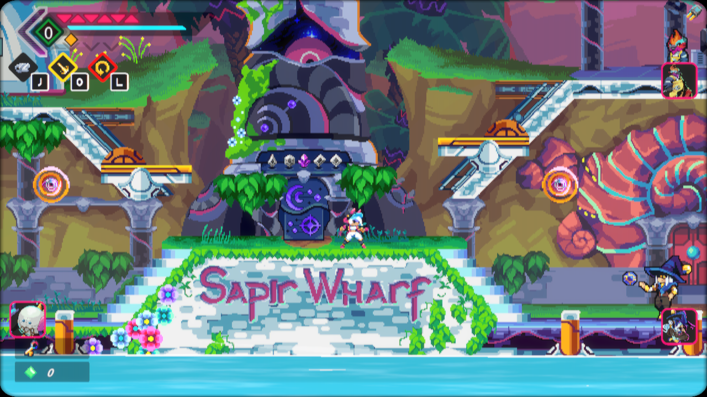

Shadow Mask:  
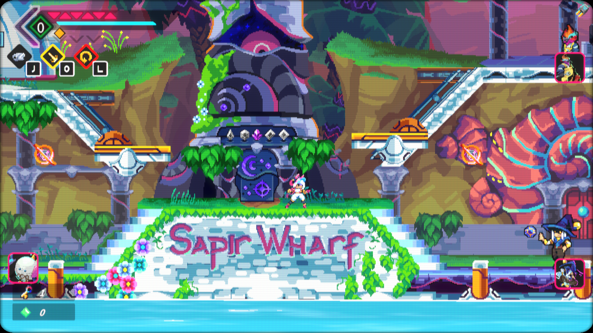

Slot Mask:  
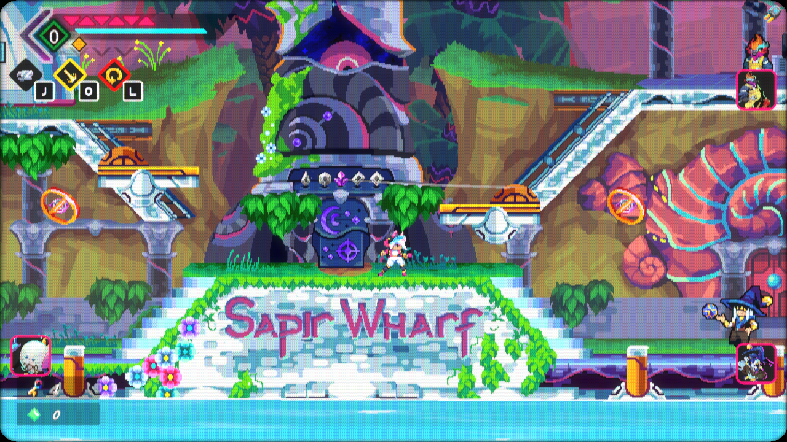

## Installation

Install Rehsade from the site: [Reshade](https://reshade.me)

Select Elise  
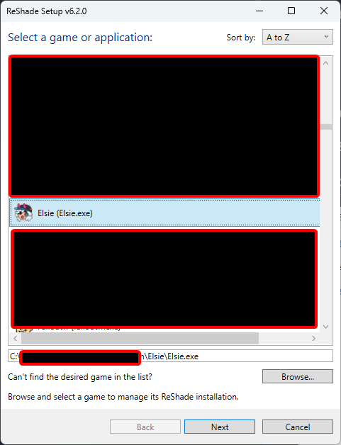  

Select Microsoft DirectX 10/11/12  
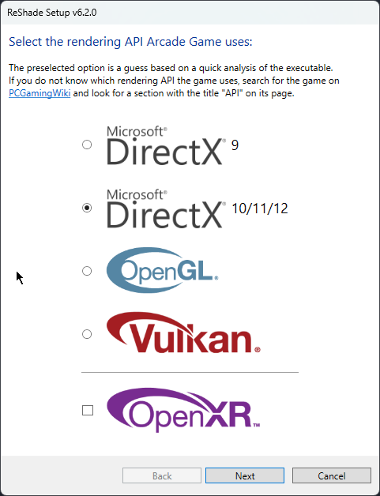  

In the effect selection, keep the first 2 defaults and select:  
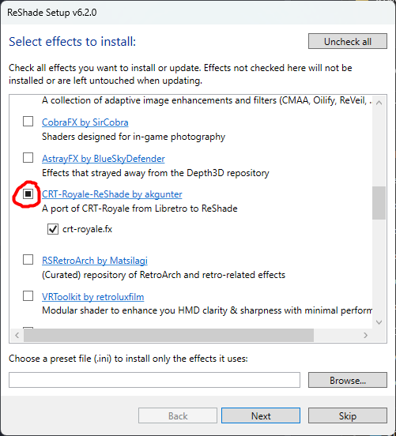  

Drag and drop [Reshade.ini](Reshade.ini) to minimize interaction with the reshade interface.  
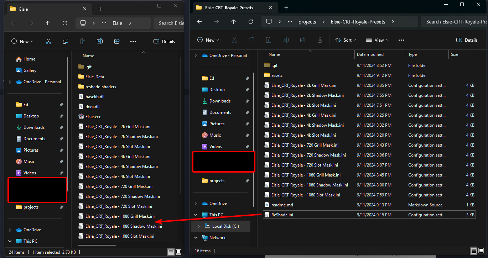  

Selecting a preset:  
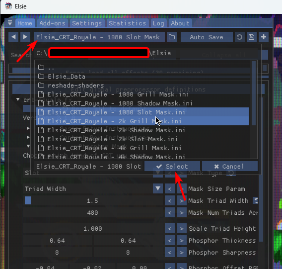  

### If using provided Reshade.ini keybinds:

* HOME to toggle reshade interface
* PAGE UP to toggle effect
* PAGE DOWN to reload effect
